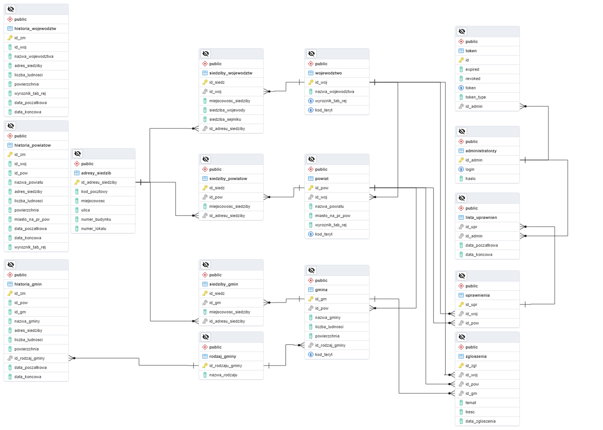

# BD2-PWR-AdministrativeDivisionOfPoland
Projekt realizowany w ramach kursu Bazy Danych 2 - Backend.

## Temat
Baza danych aktualnego podziału administracyjnego Polski.

## Baza danych
W celu skonfigurowania bazy danych, na danym urządzeniu powinien być zainstalowany serwer PostgreSQL.

- Skrypt pozwalający utworzyć pustą bazę: [administrative_division_of_poland](https://github.com/LUKIS123/BD2-PWR-AdministrativeDivisionOfPoland/blob/main/administrative_division_of_poland.sql)
- Diagram ERD:


## Uruchomienie aplikacji
W celu wygenerowania pliku wykonywalnego należy uruchomić skrypt ```bootJar``` przy wykorzystaniu narzędzia budowania gradle. Można wykonać tę akcję z poziomu IDE bądź przy użyciu komendy:
<br/>
```
$./gradlew bootJar
```
Plik wykonywalny wygenerowany zostanie w ścieżce ./API/libs w postaci pliku .jar.
W celu uruchomienia należy skorzystać z komendy:
```
$java -jar administrative-division-of-poland-backend.jar
```
<br/>

W celu zmiany konfiguracji połączenia z bazą danych należy zmienić dane w pliku konfiguracyjnym ```./AdministrativeDivisionOfPoland-Backend/API/resources/application.yml``` w poniższej sekcji, podając kolejno URL do bazy danych, nazwę użytkownika oraz hasło do bazy danych.

```yml
spring:
  datasource:
    url: jdbc:postgresql://0.0.0.0:5432/database_name
    username: postgres
    password: YOUR_PASSWORD
```
- Dokumentacja SWAGGER dostępna pod ścieżką: ```http://localhost:8085/swagger-ui/index.html#/```
- UWAGA: Port na jakim wystawione jest API można również ustawić w [pliku konfiguracyjnym](https://github.com/LUKIS123/BD2-PWR-AdministrativeDivisionOfPoland/blob/main/AdministrativeDivisionOfPoland-Backend/API/src/main/resources/application.yaml)

## Aplikacja dostępowa
Podczas realizacji projektu, w celu komunikacji z REST API napisana została aplikacja dostępowa przy wykorzystaniu biblioteki JavaFX:
- [https://github.com/KuchnowskiP/AdministrativeDivisionOfPoland](https://github.com/KuchnowskiP/AdministrativeDivisionOfPoland)

Jako że aplikacja dostępowa również pisana była w języku Java, modele udostępniane przez API zawarte są w module ```./AdministrativeDivisionOfPoland-Backend/Contract```.
W celu ich wykorzystania, wystarczy jedynie wygenerować plik ```.jar``` z modułu ```Contract``` i załączyć go do projektu.
